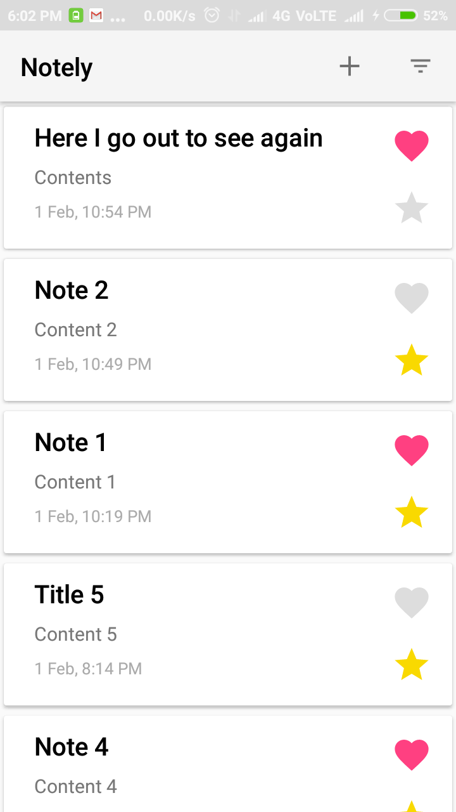
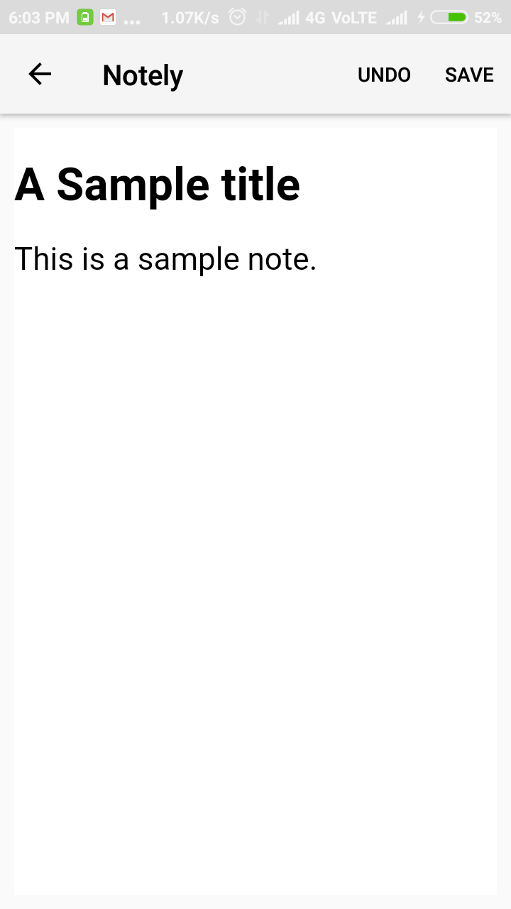
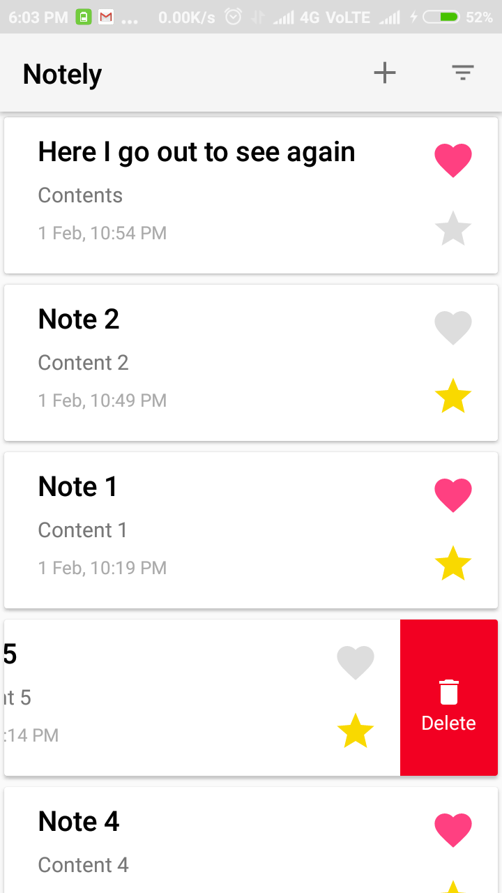
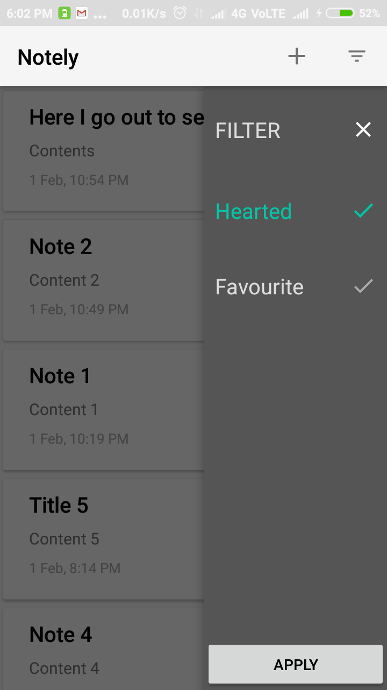

Continuous integration by CircleCi

# Notely
A simple app to make and manage notes.

This app is made in Kotlin language with all of the best practices suggested in Google IO/2017 using ViewModels.

This app is designed with MVVM pattern.

Unit tests written in Robolectric.

### Libraries used
1. Android Architecture Components
1. Room Database
1. RxJava2
1. Retrofit
1. Dagger2 
1. JUnit
1. Robolectric
1. PowerMockito

#### Screenshots

